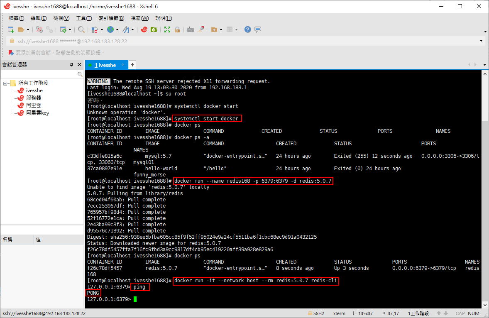
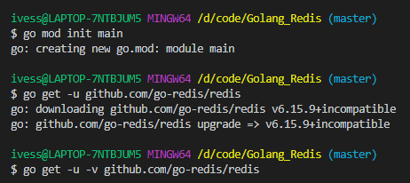
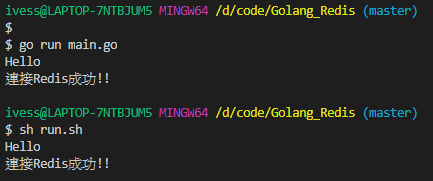
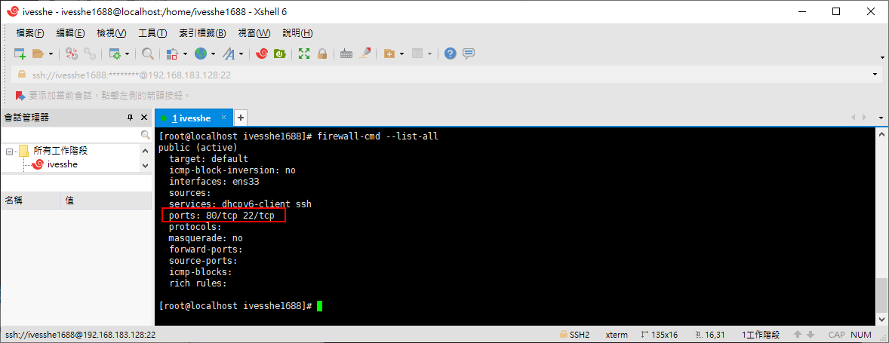
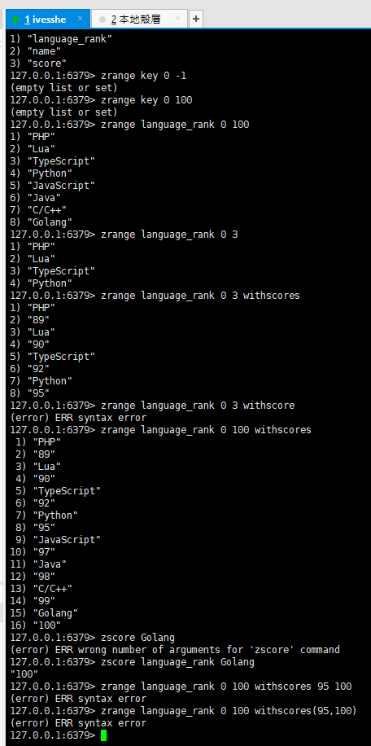
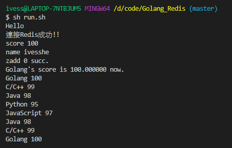

# Golang_Redis
這裡只有簡單的練習，以後有空再多作一點操作，主要是Redis先要單獨完整練習過一輪，再來用go操作，才比較會有概念

# 使用VMWare虛擬機

## 使用docker啟動一個Redis Server

```shell
docker run --name redis168 -p 6379:6379 -d redis:5.0.7
```

## 再跑一個Redis Client

```shell
docker run -it --network host --rm redis:5.0.7 redis-cli
```



# 下載並安裝

```shell
go get -u -v github.com/go-redis/redis
```

裡面有很多操作的文檔可以參考

[github.com/go-redis/redis](https://github.com/go-redis/redis)



這裡有查到另一套框架，但star數是0，不知何原因，但也查的到相關的資料

[garyburd/redigo](https://github.com/garyburd/redigo)

# 連接成功



這裡自己有個小疑問，這邊vm上的centos的防火牆6379端口我沒開阿，但也可以連接成功，這樣一想好像之前的MySQL也沒開3306端口，也是能連接,這裡先記錄一下，以後再研究



# 執行結果

搭配redis-cli及程式，兩邊操作觀察，指令還不是很熟，也沒查文檔，打錯很多

實際要操作可查這裡

[Redis.cn](http://redis.cn/)



